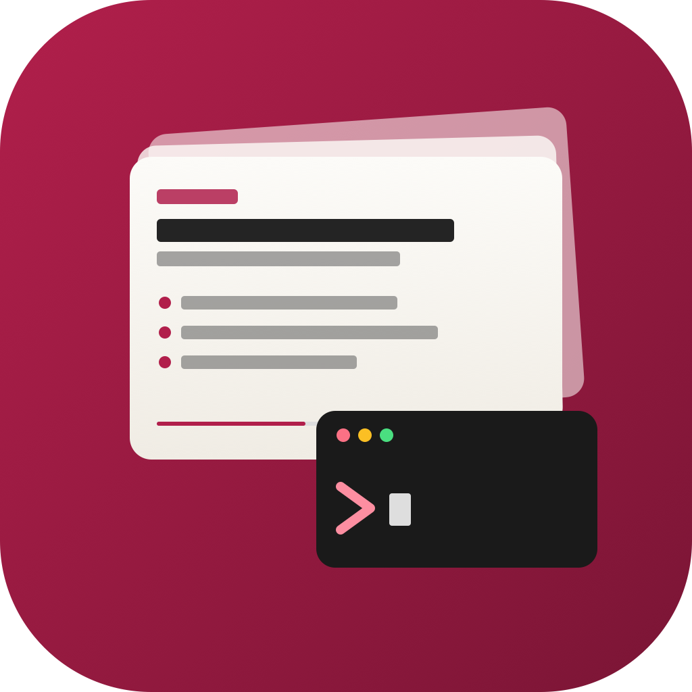
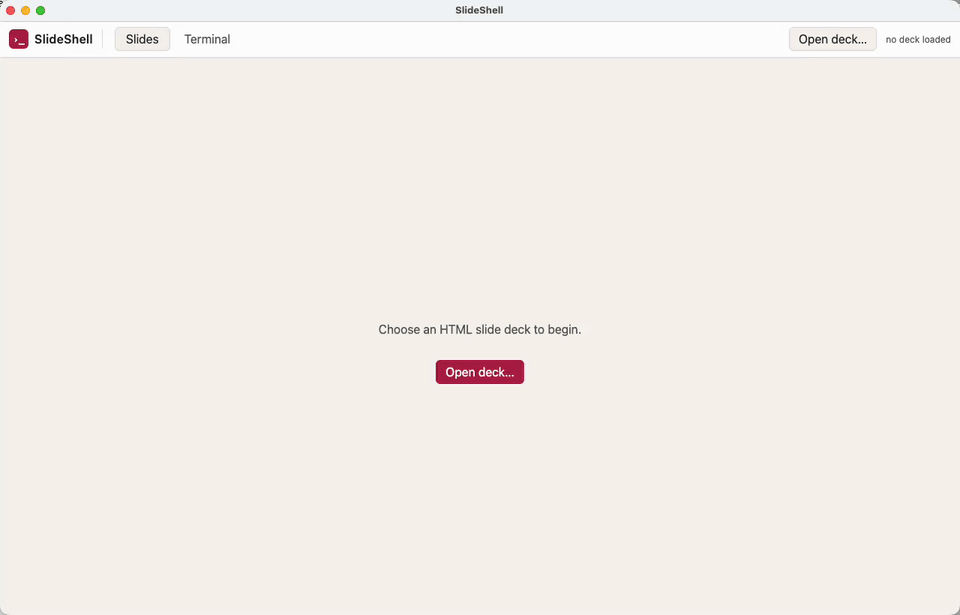

# SlideShell

> A handy app for when presenting: show a slide deck and switch instantly to a real `zsh` terminal in the same window.

SlideShell is a tiny Electron app with two tabs:

1. **Slides** — loads any self-contained HTML slide deck in an iframe.
2. **Terminal** — a full-featured `zsh` session powered by [xterm.js](https://xtermjs.org/) and [node-pty](https://github.com/microsoft/node-pty).

Press <kbd>⌘</kbd>+<kbd>`</kbd> (or <kbd>Ctrl</kbd>+<kbd>`</kbd>) to flip between the two. No more alt-tabbing to a separate terminal in the middle of a demo, no more risk of clicking the wrong window and exposing your messy desktop.

<p align="center">
  
</p>

## Demo

<p align="center">
  
</p>

## Features

- **Live HTML decks** — open any local `.html` file via the OS file dialog; SlideShell renders it untouched, so all the deck's own keyboard shortcuts (←/→, space, `n`, `f`, …) keep working.
- **Real terminal** — a proper login `zsh` (or your `$SHELL`), not a fake REPL. Your `~/.zprofile` and `~/.zshrc` are honoured, so aliases, `nvm`, `pyenv`, prompt themes, etc. all work exactly as they do in Terminal.app or iTerm.
- **Snappy tab switching** — <kbd>⌘</kbd>+<kbd>`</kbd> toggles tabs. The terminal automatically re-fits and re-sizes the underlying PTY when you switch in or resize the window.
- **Light + dark theme** — chrome follows `prefers-color-scheme` and uses the same Clawpilot token palette as the bundled sample deck.
- **Native-feeling icon** — the macOS Dock, taskbar, and in-window favicon all share a custom presentation-deck-with-terminal icon (`assets/icon.{svg,png,icns}`).

## Requirements

- macOS, Linux, or Windows
- Node.js 18+ (Node 20 LTS recommended)
- A C/C++ toolchain available for `node-gyp` to rebuild `node-pty` against Electron's Node ABI:
  - **macOS**: Xcode Command Line Tools (`xcode-select --install`)
  - **Linux**: `build-essential` (Debian/Ubuntu) or equivalent
  - **Windows**: Visual Studio Build Tools with the "Desktop development with C++" workload

## Install

```bash
git clone https://github.com/coneilen/slideshell.git
cd slideshell
npm install
```

`npm install` runs `electron-rebuild -f -w node-pty` automatically as a `postinstall` step so the native pty binding is compiled against the exact Electron version. If that ever drifts (e.g. after upgrading Electron), rerun it explicitly:

```bash
npm run rebuild
```

## Run

```bash
npm start
```

This launches the Electron app. On first run:

1. Click **Open deck…** in the top bar (or the big button in the centre of the Slides tab).
2. Pick any `.html` file. A sample is included at `qmd-llmwiki-slide-presentation.html`.
3. The deck loads in the Slides tab.
4. Click the **Terminal** tab — or press <kbd>⌘</kbd>+<kbd>`</kbd> — to drop into `zsh` in your home directory.

## Keyboard shortcuts

| Shortcut | Action |
|---|---|
| <kbd>⌘</kbd>+<kbd>`</kbd> / <kbd>Ctrl</kbd>+<kbd>`</kbd> | Toggle Slides / Terminal tab |
| <kbd>→</kbd> / <kbd>Space</kbd> / <kbd>PageDown</kbd> | Next slide *(handled by the deck)* |
| <kbd>←</kbd> / <kbd>PageUp</kbd> | Previous slide *(handled by the deck)* |
| <kbd>n</kbd> | Toggle speaker notes *(handled by the deck)* |
| <kbd>f</kbd> | Fullscreen *(handled by the deck)* |
| <kbd>Esc</kbd> | Exit fullscreen |

All slide-related shortcuts come from the deck's own `<script>` block — SlideShell just renders the iframe and stays out of the way. Make sure the Slides tab has keyboard focus (click anywhere inside it) for them to register.

## Bring your own deck

SlideShell is intentionally format-agnostic. Anything that works as a standalone HTML file will work:

- The **Clawpilot deck template** demonstrated by `qmd-llmwiki-slide-presentation.html` — a single self-contained file with `<article class="slide" data-title="…">` slides, speaker notes, and a built-in nav bar.
- **Reveal.js** exports, **Quarto** revealjs HTML, **Marp** standalone HTML — anything that renders without a dev server.
- A plain webpage you happen to want on screen during a demo.

If your deck pulls in external assets (images, fonts, JS), keep them next to the HTML file; the iframe is loaded over `file://` so relative paths resolve as you'd expect.

## Architecture

Three layers, talking only through a narrow IPC contract:

```
 main.js  ── IPC ──  preload.js  ──  window.api  ──  renderer/renderer.js
 (Node)              (bridge)        (renderer)
   │
   └── node-pty zsh processes
```

- **Main process (`main.js`)** owns the BrowserWindow, the file dialog, and the `node-pty` process map. It is the only place that imports `node-pty`. All pty processes are killed when the window closes.
- **Preload (`preload.js`)** is the *only* bridge into the renderer. It uses `contextBridge.exposeInMainWorld("api", …)` to expose `pickDeck()` and a `pty` namespace (`spawn`, `write`, `resize`, `kill`, `onData`, `onExit`). The renderer runs with `contextIsolation: true` and `nodeIntegration: false`.
- **Renderer (`renderer/`)** is plain HTML + CSS + a single classic-script `renderer.js`. xterm.js is loaded directly from `node_modules/` via UMD — there is no bundler, no build step.

| IPC channel | Direction | Payload | Notes |
|---|---|---|---|
| `deck:pick` | renderer → main (invoke) | — | Returns absolute path string or `null`. |
| `pty:spawn` | renderer → main (invoke) | `{ cols, rows }` | Returns the pty id (the process pid as a string). |
| `pty:input` | renderer → main (send) | `{ id, data }` | Raw keystrokes from xterm. |
| `pty:resize` | renderer → main (send) | `{ id, cols, rows }` | |
| `pty:kill` | renderer → main (send) | `{ id }` | |
| `pty:data` | main → renderer | `{ id, data }` | Renderer filters by id. |
| `pty:exit` | main → renderer | `{ id, exitCode, signal }` | |

See [`.github/copilot-instructions.md`](.github/copilot-instructions.md) for the full developer guide.

## Project layout

```
.
├── main.js                  # Electron main process: window, file dialog, node-pty manager
├── preload.js               # contextBridge → window.api
├── renderer/
│   ├── index.html           # Tabs + iframe + xterm container, plus CSP
│   ├── renderer.js          # Tab logic, deck loader, xterm wiring
│   └── styles.css           # Clawpilot --cp-* theme tokens, light + dark
├── assets/
│   ├── icon.svg             # Editable source
│   ├── icon.png             # 1024×1024 raster, used at runtime
│   └── icon.icns            # macOS bundle icon (multi-resolution)
├── qmd-llmwiki-slide-presentation.html  # Sample deck
├── package.json
└── .github/
    └── copilot-instructions.md
```

## Troubleshooting

**"Module did not self-register" / `NODE_MODULE_VERSION` mismatch on startup.**
The pre-built `node-pty` was compiled against a different Node ABI than the one Electron uses. Run `npm run rebuild`.

**Buttons don't respond / terminal is blank.**
Open DevTools (<kbd>⌘</kbd>+<kbd>⌥</kbd>+<kbd>I</kbd> / <kbd>Ctrl</kbd>+<kbd>Shift</kbd>+<kbd>I</kbd>) and check the Console. A common cause is a CSP violation when a deck pulls in a remote asset — extend the `<meta http-equiv="Content-Security-Policy">` in `renderer/index.html` if needed.

**Slide keyboard shortcuts don't fire.**
Click anywhere inside the slide area first so the iframe captures focus; SlideShell does not intercept or forward slide-deck keys.

## License

See [LICENSE](LICENSE).
